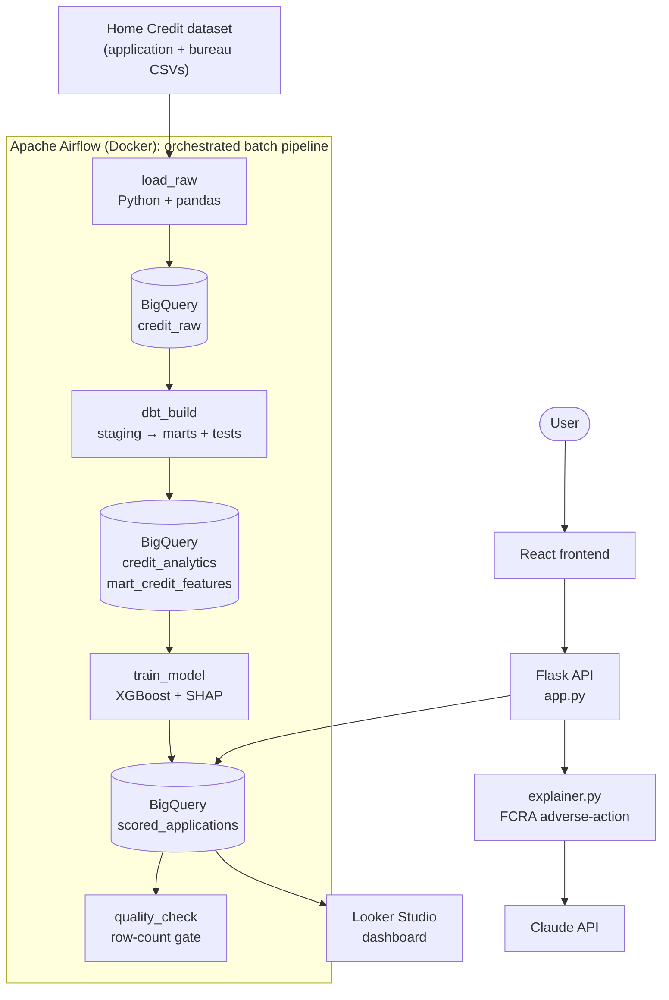
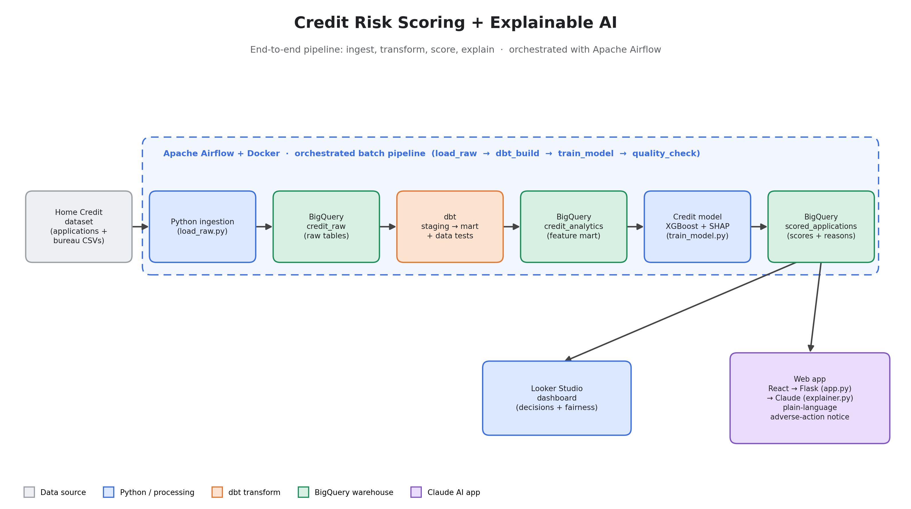
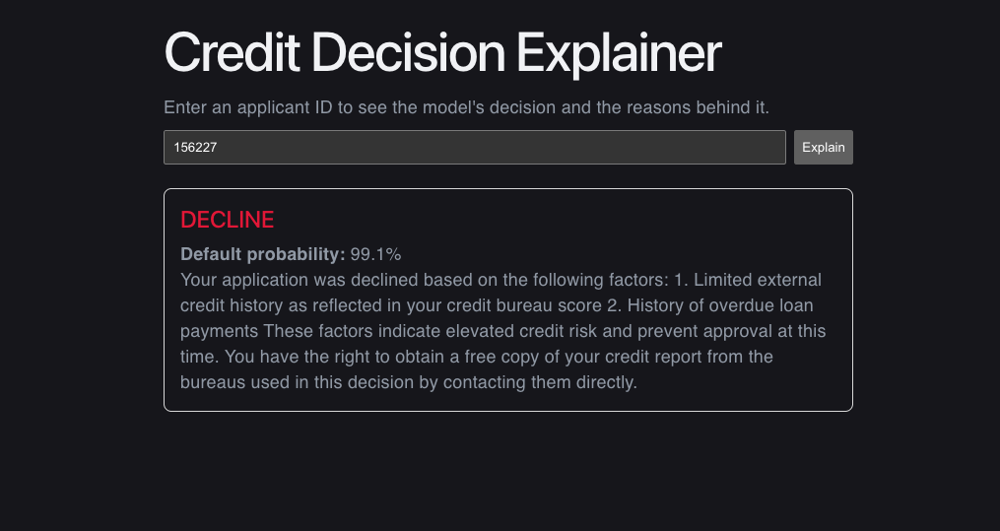
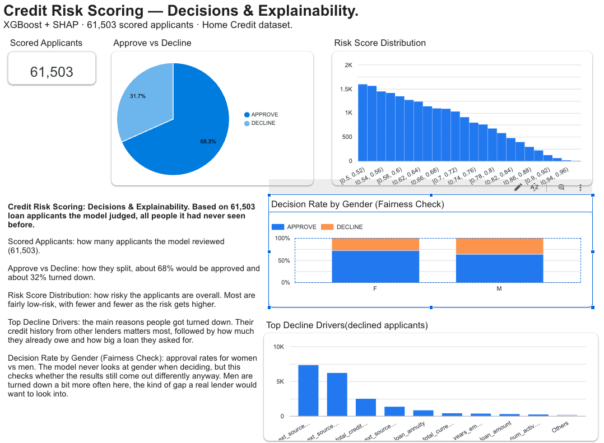
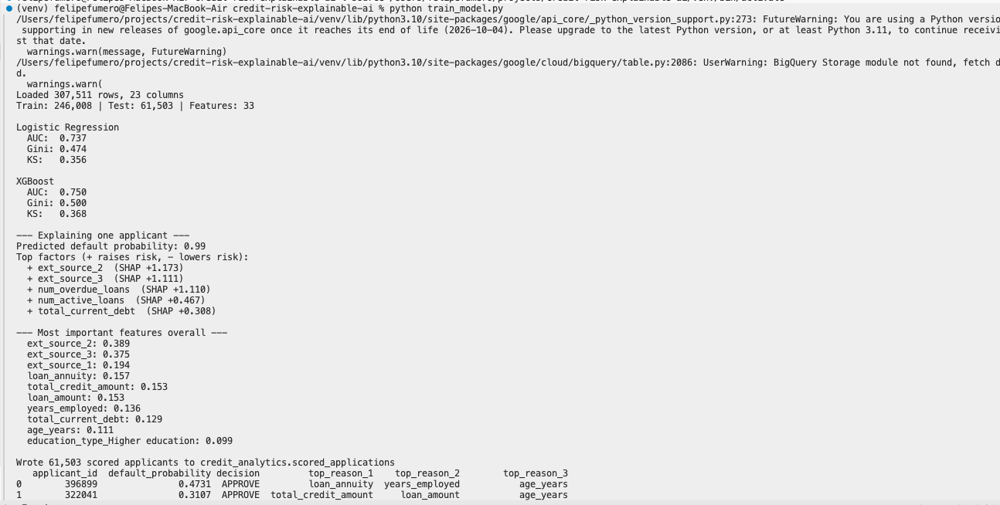
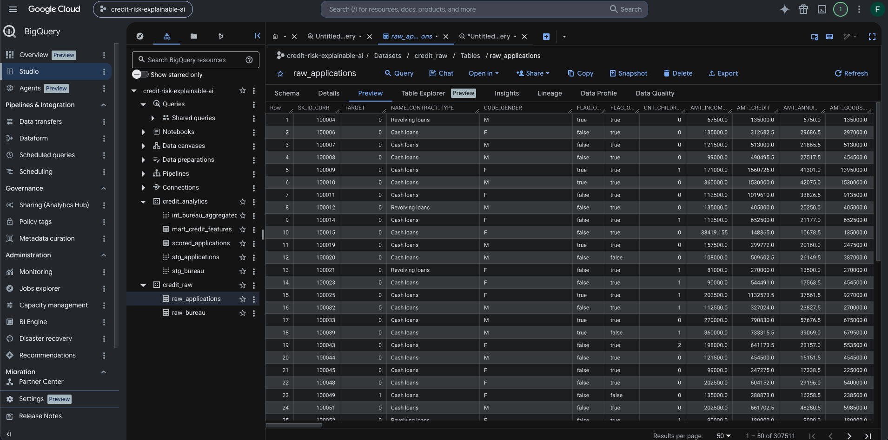
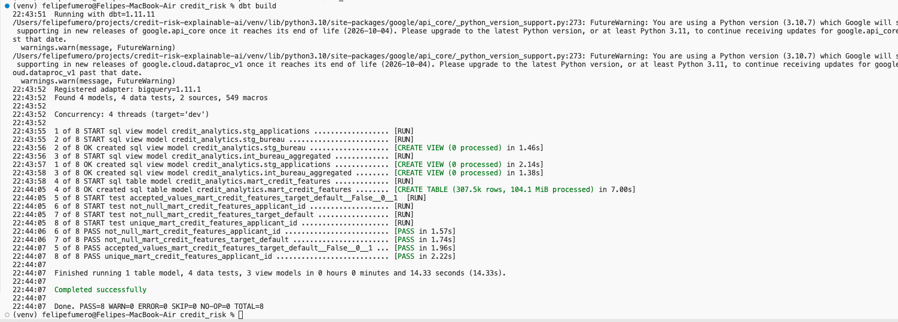
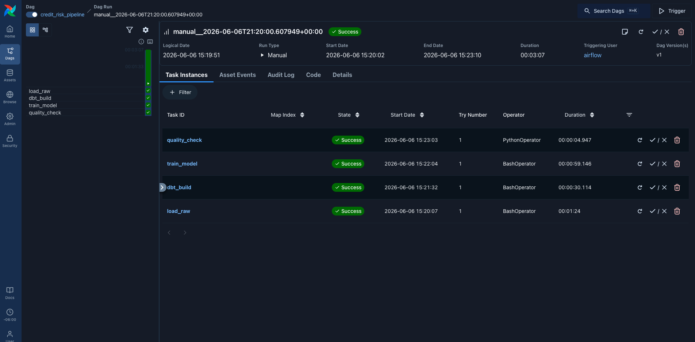

# Credit Risk Scoring + Explainable AI

> An end-to-end credit-risk pipeline that scores loan applicants, makes an approve/decline decision, and generates plain-English, **FCRA-style adverse-action explanations** with Claude — built GCP-native on BigQuery.

Enter an applicant ID and get back a decision, a default probability, and a clear explanation of _why_ — written from the model's own top risk factors, with protected attributes deliberately excluded.

---

## Overview

This project ingests the **Home Credit Default Risk** dataset into **Google BigQuery**, transforms it into clean analytical models with **dbt**, trains an **XGBoost** credit-risk model (benchmarked against a logistic-regression baseline), and uses **SHAP** to extract the top factors behind each individual prediction. Those factors are turned into **plain-English adverse-action explanations** by the **Claude API**, served through a **Flask + React** app, with a **Looker Studio** dashboard for portfolio-level monitoring.

It demonstrates a complete, credit-focused data + ML stack — ingestion, warehousing, transformation, modeling, explainability, an AI explanation layer, and fairness monitoring — end to end, on a Google Cloud–native stack.

---

## Architecture



1. **Ingestion** — `load_raw.py` loads the application and bureau CSVs into BigQuery (`credit_raw`).
2. **Transformation** — dbt models clean the data, aggregate the bureau history to one row per applicant, and build a single feature mart (`mart_credit_features`), with data tests on keys and the target.
3. **Modeling** — `train_model.py` trains XGBoost vs. a logistic-regression baseline, evaluates with credit-industry metrics (AUC / Gini / KS), runs SHAP for per-applicant reason codes, and writes results to `scored_applications`.
4. **Explanation layer** — a React UI sends an applicant ID to a Flask API; Flask looks up the decision and reason codes, and Claude turns them into a plain-English, adverse-action-style explanation.
5. **Monitoring** — Looker Studio reads the scored data for score distribution, decision split, top decline drivers, and a fairness check.

---

## Data Source

Data comes from the [**Home Credit Default Risk**](https://www.kaggle.com/c/home-credit-default-risk) dataset — a widely used, real-world credit dataset.

| File                    | Grain                  | Rows      | Notes                                             |
| ----------------------- | ---------------------- | --------- | ------------------------------------------------- |
| `application_train.csv` | one row per applicant  | 307,511   | Includes the `TARGET` default flag (~8% positive) |
| `bureau.csv`            | one row per prior loan | 1,716,428 | Credit-bureau history, aggregated per applicant   |

The dataset is **imbalanced** (~8% default rate), which is why evaluation uses ranking metrics (AUC / Gini / KS) rather than accuracy.

---

## Tech Stack

| Layer                | Tool                                 |
| -------------------- | ------------------------------------ |
| Ingestion            | Python, pandas                       |
| Data warehouse       | Google BigQuery                      |
| Transformation       | dbt                                  |
| Modeling             | scikit-learn, XGBoost                |
| Explainability       | SHAP                                 |
| AI explanation layer | Claude API (Anthropic)               |
| Backend              | Flask                                |
| Frontend             | React + Vite                         |
| Dashboard            | Looker Studio                        |
| Orchestration        | Apache Airflow (Docker + PostgreSQL) |

---

## Features

- **Real-scale ingestion** — ~308K applications and ~1.7M bureau records loaded into BigQuery, with idempotent re-runs.
- **dbt transformation layer** — staging views, an intermediate model that aggregates bureau history to one row per applicant (a grain change), and a final feature mart, with generic tests on the key and target.
- **Model benchmarking** — XGBoost vs. a logistic-regression baseline, evaluated with **AUC, Gini, and KS** — the metrics credit teams actually use.
- **Per-applicant explainability** — SHAP extracts the top factors driving each individual prediction (local explainability) plus global feature importance.
- **Adverse-action explanations** — Claude converts reason codes into a 2–4 sentence plain-English explanation, constrained to only the model's actual reasons.
- **Fairness-aware by design** — protected attributes are excluded from the model and filtered out of every explanation (see below).
- **Interactive app** — enter an applicant ID → decision (color-coded), default probability, and the explanation.
- **Monitoring dashboard** — score distribution, approve/decline split, top decline drivers, and a decision-rate-by-gender fairness check.

---

## Responsible AI / Fair Lending

Credit decisioning is regulated, and this project is built to reflect that:

- **`gender` is excluded from the model's features.** Under the U.S. Equal Credit Opportunity Act (ECOA), sex cannot be used in credit decisions. Removing it cost only ~0.002 AUC — a negligible price for a non-negotiable requirement.
- **The explanation layer filters protected attributes.** Even if a protected-class feature appeared among a model's top factors, `explainer.py` strips it (age, gender, family status) so it can never surface in an adverse-action reason.
- **Fairness monitoring.** The dashboard includes a decision-rate-by-gender chart as a disparate-impact check — confirming outcomes stay close across groups even though gender isn't an input.

This is a **portfolio demonstration of fair-lending awareness**, not a certified-compliant production system. See Limitations.

---

## Model Performance

Honest, untuned baseline results on a held-out test set (61,503 applicants, gender excluded, 33 features):

| Model                          | AUC       | Gini      | KS        |
| ------------------------------ | --------- | --------- | --------- |
| Logistic Regression (baseline) | 0.737     | 0.474     | 0.356     |
| **XGBoost (selected)**         | **0.750** | **0.500** | **0.368** |

XGBoost wins and is used for scoring. These are **solid, honest baseline numbers — not leaderboard-tuned** (competition-winning solutions push AUC ~0.80 with heavy feature engineering and stacking). The top global drivers are the external credit scores (`ext_source_2`, `ext_source_3`, `ext_source_1`), consistent with how real credit models behave.

## Screenshots

**Architecture**



**Credit Decision Explainer (the AI layer):**



**Looker Studio dashboard:**



**Model training & SHAP output:**



**Data in BigQuery:**



**dbt run:**



**Airflow UI**



---

## How the Explanation Layer Works

1. The model scores an applicant → a default probability and a decision (DECLINE if probability ≥ threshold, else APPROVE).
2. SHAP identifies the factors pushing that prediction toward default; the top reason codes are stored in `scored_applications`.
3. On request, Flask looks up the applicant's decision and reason codes from BigQuery.
4. `explainer.py` maps the codes to human-readable labels, **filters out any protected attributes**, and sends them to Claude with a constrained, FCRA adverse-action-style prompt.
5. Claude writes a 2–4 sentence plain-English explanation using **only the supplied reasons** — no invented factors, no protected attributes.
6. The decision, probability, and explanation are returned to the React UI.

---

## Orchestration

The batch pipeline is orchestrated with **Apache Airflow 3.2**, running locally in **Docker**. A single DAG, `credit_risk_pipeline`, runs the four stages in order and stops if any stage fails:

`load_raw → dbt_build → train_model → quality_check`

- **load_raw** — ingests the raw CSVs into BigQuery
- **dbt_build** — runs the dbt models and data tests
- **train_model** — trains, runs SHAP, writes `scored_applications`
- **quality_check** — a data-quality gate that fails the run if `scored_applications` is empty

The first three are `BashOperator` tasks wrapping the same scripts you can run by hand; the last is a `PythonOperator` that queries BigQuery and raises on invalid output. Airflow runs from the official Docker Compose stack (Postgres metadata DB, Redis, Celery worker) on a small custom image that adds the project's Python dependencies. A full run completes in ~3 minutes locally.

> **Scope:** orchestration covers the batch scoring pipeline only. The Claude explanation layer is an on-demand API and is intentionally not part of the scheduled DAG. It runs locally and is triggered manually (`schedule=None`) — a portfolio setup, not a deployed scheduler.

## Running Locally

### Prerequisites

- Python 3.10+
- Node.js 18+
- A Google Cloud project with BigQuery enabled
- An Anthropic (Claude) API key
- The Home Credit dataset CSVs (`application_train.csv`, `bureau.csv`)
- macOS only: `brew install libomp` (required for XGBoost)

### 1. Clone and set up Python

```bash
git clone https://github.com/ffumero2003/credit-risk-explainable-ai.git
cd credit-risk-explainable-ai
python3 -m venv venv
source venv/bin/activate
pip install -r requirements.txt
```

> Note: `requirements.txt` pins `xgboost<3` — SHAP's TreeExplainer is incompatible with the way XGBoost 3.x stores `base_score`.

### 2. Add your key

Create a `.env` file in the project root:

```
ANTHROPIC_API_KEY=your_anthropic_key
```

### 3. Authenticate BigQuery

```bash
gcloud auth application-default login
gcloud auth application-default set-quota-project credit-risk-explainable-ai
```

### 4. Run the pipeline

```bash
python load_raw.py                 # load CSVs into BigQuery (credit_raw)
cd credit_risk && dbt build && cd ..   # build + test analytical models
python train_model.py              # train, evaluate, run SHAP, write scored_applications
```

### 5. Run the app

```bash
# terminal 1 — backend (runs on port 5001)
python app.py

# terminal 2 — frontend
cd frontend && npm install && npm run dev
```

Open the React app (e.g. http://localhost:5173) and enter an applicant ID from the scored test set.

---

## Limitations & Honest Framing

This is a **portfolio project**, not a production credit system. Specifically:

- **Test-set scoring only.** The app explains the 61,503 held-out applicants in `scored_applications`; other IDs return 404.
- **Fixed decision threshold (0.5).** This produces a ~31.5% decline rate — illustrative, not calibrated to any real risk appetite or approval-rate target.
- **Untuned model.** AUC ~0.747 is an honest baseline, not a competition-optimized score.
- **Partial fair-lending coverage.** `gender` is excluded, but `family_status` (marital status, also ECOA-protected) and `age_years` (nuanced under Reg B) currently remain in the model — a known limitation, listed below to address.
- **No live deployment yet.** The batch pipeline is orchestrated locally with Airflow (Docker), triggered manually rather than scheduled on managed infrastructure. The app runs locally.
- **Explanations are illustrative** of an adverse-action workflow; they are not legal compliance advice.

---

## Future Improvements

- Schedule the Airflow DAG and run it on managed infrastructure (e.g. Cloud Composer) with retries, alerting, and SLAs

---

## Author

**Felipe Fumero** — [LinkedIn](https://www.linkedin.com/in/felipe-fumero-b5186030b/) · [GitHub](https://github.com/ffumero2003)
